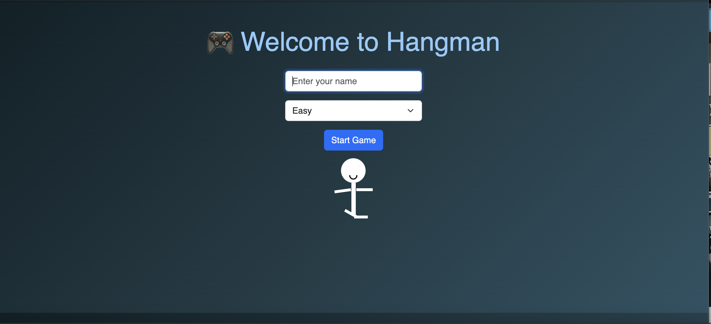

# 🎮 Hangman Game — Python + Flask Web App

A fun, interactive Hangman game with animated cartoon characters, sound effects, and difficulty levels — built using **Flask**, **HTML/CSS/JavaScript**, and **Bootstrap**!

---

## 🚀 Features

- 🧠 **Difficulty Levels** — Easy, Medium, Hard
- 👦 **Username Input** — Personalized game experience
- 💃 **Animated Stick Figure** — Bounces, waves, kicks, and blinks!
- 🔊 **Sound Effects** — Plays a welcome sound when the game starts
- 🧩 **Responsive UI** — Clean Bootstrap-based interface

---

## 📁 Project Structure

hangman_project/
│
├── app.py                    # Flask backend
├── hungman_word.py          # Word logic / API integration
├── templates/
│   ├── index.html           # Homepage with form and animation
│   ├── game.html            # Game screen (guessing interface)
│   └── result.html          # Game result page
│
├── static/
│   ├── css/
│   │   └── style.css        # Optional custom styles
│   └── sounds/
│       └── welcome.mp3      # Welcome audio
│
├── .gitignore
└── README.md                # You're reading it!
